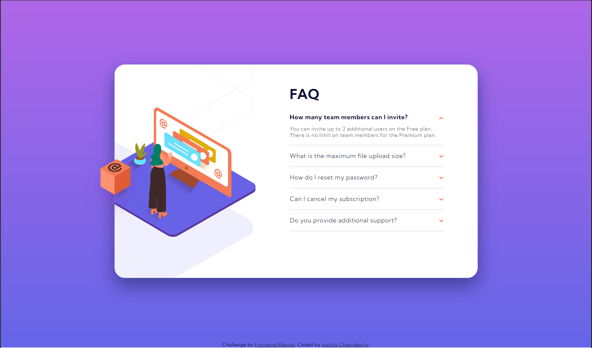
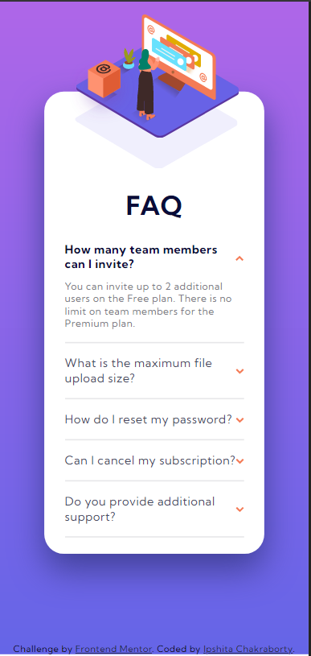

# Frontend Mentor - FAQ accordion card solution

This is a solution to the [FAQ accordion card challenge on Frontend Mentor](https://www.frontendmentor.io/challenges/faq-accordion-card-XlyjD0Oam). Frontend Mentor challenges help you improve your coding skills by building realistic projects. 

## Table of contents

- [Overview](#overview)
  - [The challenge](#the-challenge)
  - [Screenshot](#screenshot)
  - [Links](#links)
- [My process](#my-process)
  - [Built with](#built-with)
  - [What I learned](#what-i-learned)
  - [Useful resources](#useful-resources)
- [Author](#author)


## Overview

### The challenge

Users should be able to:

- View the optimal layout for the component depending on their device's screen size
- See hover states for all interactive elements on the page
- Hide/Show the answer to a question when the question is clicked

### Screenshot

- Desktop Version

[](./screenshot-desktop.PNG)
- Mobile Version

[](./screenshot-mobile.PNG)


### Links

- Solution URL: [FAQ Accordion Card Component](https://github.com/OMEGAeNcore/frontendmentor/tree/main/faq-accordion-card-main)
- Live Site URL: [Add live site URL here](https://your-live-site-url.com)

## My process

### Built with

- Semantic HTML5 markup
- CSS custom properties
- Flexbox
- CSS Grid
- Mobile-first workflow


### What I learned

Using Style sheets for different device width range
```html
  <link rel="stylesheet" href="./style-desk.css" media="screen and (min-width:951px)">
  <link rel="stylesheet" href="./style-desk-750-950.css" media="screen and (min-width: 650px) and (max-width:950px)">
  <link rel="stylesheet" href="./style-mob.css" media="screen and (max-width:400px)">
  <link rel="stylesheet" href="./style-mob-350-750.css" media="screen and (min-width: 401px) and (max-width:649px)">
```

Usage of same image by using them at different angles
  - HTML code:
  ```html
    <span class="icon-open"></span>
    <span class="icon-close"></span>
  ```

  - CSS code:
  ```css
    .reverse-arrow{
        transform: rotate(180deg);
    }
  ```

Custom Dividers
  - HTML code:
  ```html
    <hr class="divider">
  ```

  - CSS code:
  ```css
    .divider{
      border: 0;
      border-bottom: 2px solid  hsl(240, 5%, 91%); 
    }
  ```

### Useful resources

- [Overlapping Images using CSS](https://bricampgomez.com/blog/how-to-overlap-images-in-css/) - This helped me create the image theme of the component card. I really liked this pattern and will use it and also improve on it going forward.
- [Rotate Image using CSS](https://code-boxx.com/rotate-spin-image-html-css/#sec-basics) - This article helped me review how to make use of simple CSS for making an image rotate.
- [Responsive FAQ accordion dropdown | HTML and CSS Tutorial](https://www.youtube.com/watch?v=MXrtXg1kpVs) - Check out this tutorial. This video helped me out a lot with applying the accordion concept.

## Author

- Frontend Mentor - [@OMEGAeNcore](https://www.frontendmentor.io/profile/OMEGAeNcore)
- Twitter - [@IpshitaSolo](https://www.twitter.com/IpshitaSolo)
