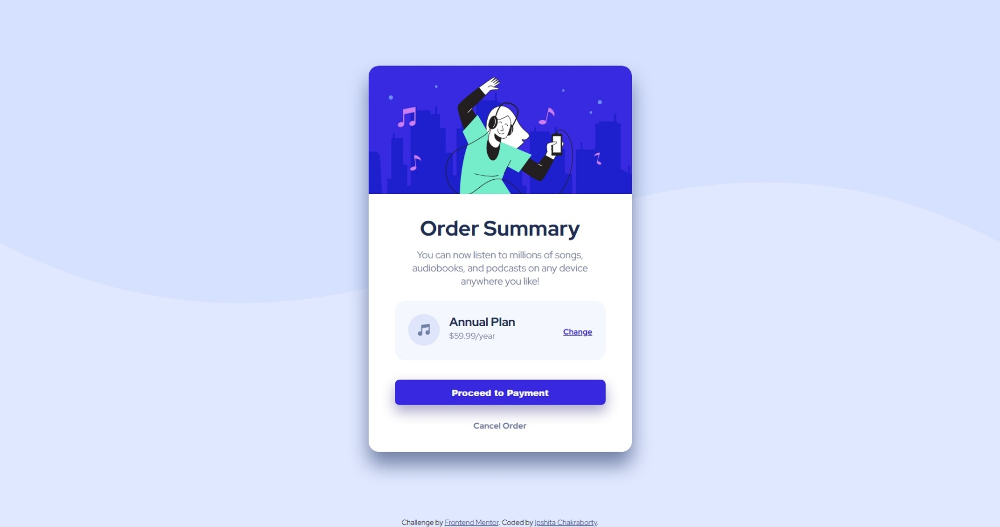

# Frontend Mentor - Order summary card solution

This is a solution to the [Order summary card challenge on Frontend Mentor](https://www.frontendmentor.io/challenges/order-summary-component-QlPmajDUj). Frontend Mentor challenges help you improve your coding skills by building realistic projects. 

## Table of contents

- [Overview](#overview)
  - [The challenge](#the-challenge)
  - [Screenshot](#screenshot)
  - [Links](#links)
- [My process](#my-process)
  - [Built with](#built-with)
  - [What I learned](#what-i-learned)
  - [Useful resources](#useful-resources)
- [Author](#author)


## Overview

### The challenge

Users should be able to:

- See hover states for interactive elements

### Screenshot

[](./screenshot.jpg)

### Links

- Solution URL: [Order Summary Component](https://github.com/OMEGAeNcore/frontendmentor/tree/main/order-summary-component-main)

## My process

### Built with

- Semantic HTML5 markup
- CSS custom properties
- Flexbox

### What I learned

Linking multiple CSS sheets, for different devices:

```
  <link rel="stylesheet" href="./style-desk.css">
  <link rel="stylesheet" media="screen and (max-device-width: 1440px)" href="./style-mobile.css">
```

Adding fonts of different styles, by using google fonts:

```
<link rel="preconnect" href="https://fonts.googleapis.com">
  <link rel="preconnect" href="https://fonts.gstatic.com" crossorigin>
  <link href="https://fonts.googleapis.com/css2?family=Red+Hat+Display&display=swap" rel="stylesheet">  

  <link rel="preconnect" href="https://fonts.googleapis.com">
  <link rel="preconnect" href="https://fonts.gstatic.com" crossorigin>
  <link href="https://fonts.googleapis.com/css2?family=Red+Hat+Display:wght@400;700&display=swap" rel="stylesheet">
```

### Useful resources

- [Box shadow property](https://www.freecodecamp.org/news/css-box-shadow-property-with-examples/) - This helped me understand the usage of the box shadow property.
- [Flex Box tricks](https://css-tricks.com/snippets/css/a-guide-to-flexbox/) - This is an amazing article which helped me finally understand about flexbox. I'd recommend it to anyone still learning this concept.


## Author

- Frontend Mentor - [@OMEGAeNcore](https://www.frontendmentor.io/profile/OMEGAeNcore)
- Twitter - [@IpshitaSolo](https://www.twitter.com/IpshitaSolo)

